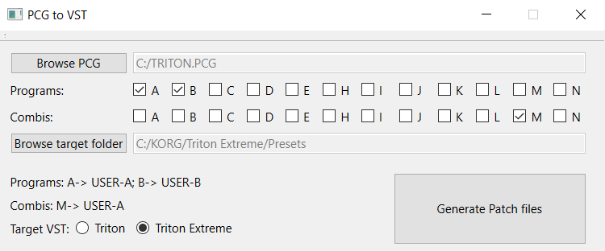

# Triton/Triton Extreme PCG to VST patch

The tool is finished! Thanks everyone for your patience! (please check the "Releases" section to download Windows executables)

This is a command line tool to convert PCG files saved from any physical Triton keyboard/module, into the .patch (json) format used by the Triton and Triton Extreme VST plugins.

## Documentation
The tool is available in two versions: with GUI and command line.
### GUI


Select your PCG file, then tick the letters of the programs/combis banks you want to export. Don't forget to select a destination folder.

Note: it is recommended to export to a temporary folder, and then manually move the presets to the VST location. Make sure to backup your previous .patch files!

Optionally, you can switch between "Triton" and "Triton Extreme" for the output format (both VSTs share the same json template but some bank IDs are different).

Then click on "Generate Patch files".

### Command line
The command line tool is the quickest solution when you already know which banks you want to export. Usage:
```
-PCG <Path> : path of the PCG file to open
-OutFolder <Path> : path of the destination folder for the output json patches
-Combi <Letters> : combis to export (max:4)
-Program <Letters> : programs to export (max:4)
[-unit_test] : performs unit test (optional)
```

Example
```
PCGToVST.exe -PCG "TRITON.PCG" -OutFolder "C:\KORG\Triton Extreme\Presets" -Program A B -Combi N
```
### Destination folder
After exporting your .patch files, you need to copy them to the VST preset folder: C:\Users\<Username>\Documents\KORG\TRITON\Presets or C:\Users\<Username>\Documents\KORG\TRITON Extreme\Presets

## List of features
- Program conversions
- Combi conversions
- User arpeggiators and drum kits
- All IFX/MFX specific parameters
- Supports partial PCG files that don't have all the Programs stored: Factory PCG and GM data are used by the tool
- Compatibility with Triton and Triton Extreme VSTs (+ Extreme specific params like Valve Force)

## Unit tests
I've manually exported to .patch files more than 500 programs/combis from the Triton Extreme VST. I regularly run my tool locally in "unit test" mode: the command compares the content of the manually converted files with files generated with my tool, and everything matches perfectly!

## Known limitations
- the VSTs only have 4 user bank slots, which is why you cannot export more than 4 banks. But you can always do multiple exports and move the files around whenever you want!
- since it is not possible to import user samples in the VSTs, if you have PCG Programs that use samples from bank 1 (RAM), they won't be exported properly. If only Korg could implement that feature!
- please use a legit copy of the Korg VSTs. The exported patch files won't work on old versions of the VSTs, the json format has changed. Supported versions are: Triton VST 1.4.1 and Triton Extreme VST 1.1.1.

## Notes about Combis
A Combi references up to 8 Timbers (programs). On a real Triton keyboard, you need the Programs to be loaded at the same time as the Combis for them to work.
The VST saves Combis in a clever way: they don't "reference" the data from the Programs, they actually copy them: it is possible to modify the settings of your timbers without altering the original Programs.
Which also means that it is absolutely acceptable to export Combis without exporting Programs at all with my tool.

If your PCG only contains Combis but no Programs at all, the tool will default to the factory settings (all the necessary information is inside a Data subfolder next to the .exe files).
Same with GM programs which are not stored at all in PCG files: the tool knows how to retrieve the information.

## TODO:
- export Global settings
- let me know if you have any suggestions or feedback!

## Thanks
Massive thanks to Xavier (Alchemist) for his hard work on the Alchemist API and for sharing the official Korg MIDI documentation that included the PCG offsets!

## Dependencies
- [rapidjson](https://github.com/Tencent/rapidjson)
- [Qt](https://github.com/qt) (GUI only - the command line version doesn't require Qt)
- [Alchemist Trinity to Triton Tools](https://sourceforge.net/projects/alchemist/)
